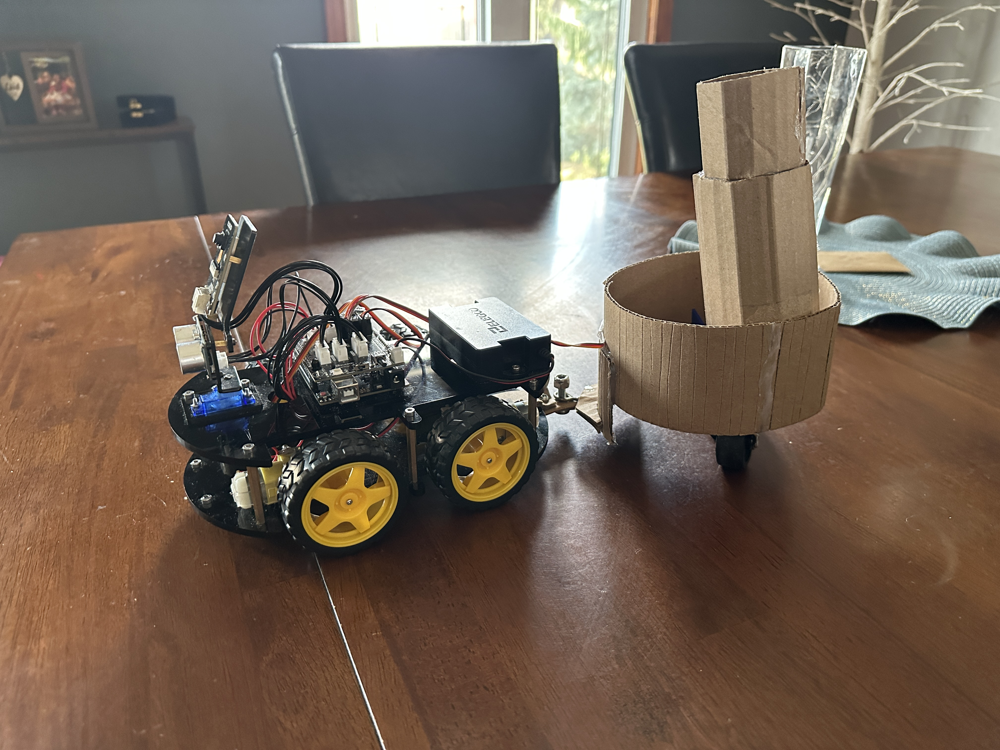
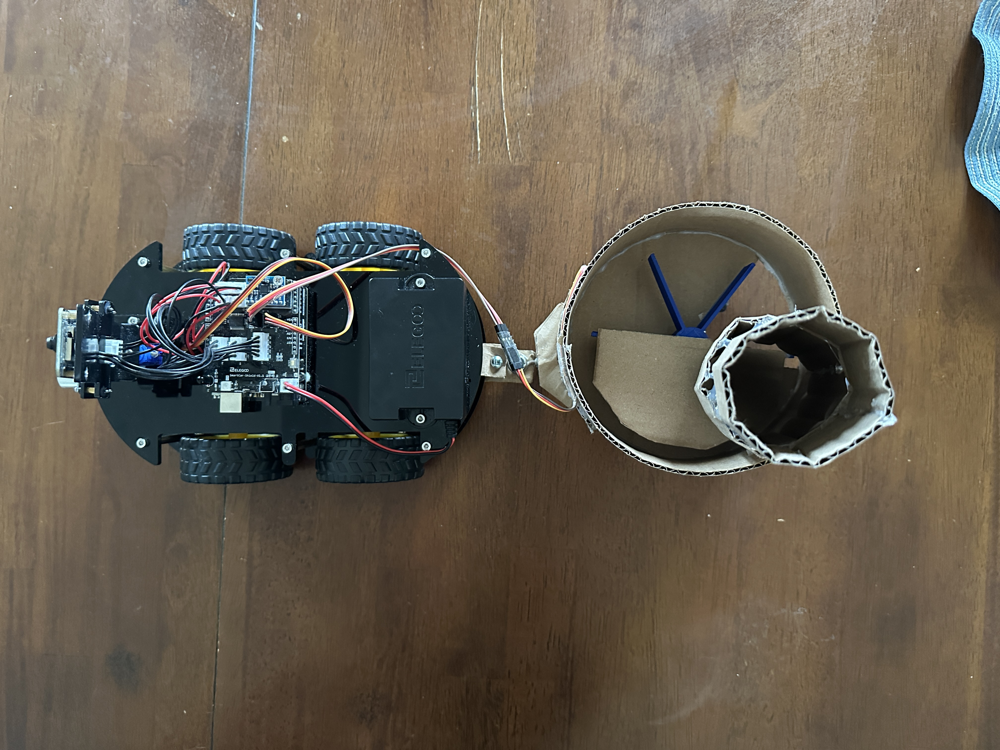

# autonomous-robot-car-arduino

## Overview
Arduino based autonomous robot car using sensors, motors, and real time control logic with an attached fertilizer dispenser

## Features 
- Sensor based navigation
- Motor control using Ardiuno
- Real time decision making

## Hardware
- Arduino Uno
- ELEGOO Smart Robot Car Kit
- Fertilizer dispenser

## Software
- Arduino C

## My Contributions
- Developed control logic for navigation
- Perfromed debugging and system testing
- Improved performance through iterative design

## Demo Video
https://drive.google.com/file/d/1KRcXIN2Q3dpWuZu-nCvPW3R0EB4DAbay/view?usp=sharing 

## Final Build

